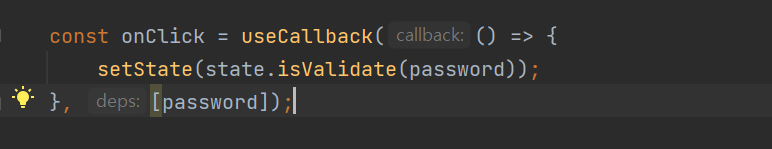

# CLASS를 활용하여 컴포넌트별 MODEL 활용방안

Class-Enum 패키지를 활용하여 컴포넌트내 로직을 최소화가 가능하며 삼항연산자를 사용하지 않아도 됨. 기존에 OR연산자를 이용하기 위해서 컴포넌트를 추가 하는 방법보다 훨씬 깔끔하게 분리가 가능한 방법
호돌맨님이 올리신 영상을 보고 좋다고 생각되서 한번 사용해보고 어떤식의 장점이있는지 활용해 보았다.

## 왜 HOOKS대신 CLASS를 사용하는가?

물론 Hooks로도  활용이 가능하다 하지만 대부분 UI단에서 Hooks의 obj를 정의하는 방식이며 그렇게 될경우 UI단에 불필요한 로직이 증가하게되고 
불필요한 로직의 증가는 유지보수의 어려움을 초래하게 된다. 간단한 변수와 함수가 같이있는 class가 오히려 한눈에 어떤역활을 하는지 파악하기 쉽기 이다. 

UI단 로직을 한번 보도록하자 

CLASS로 나눌경우 이런식으로 onClick 이벤트를 정의할 수 있고.

변화하는 값은 무조건 getMessage로 바뀐 값이 나오기때문에 UI로직단에서 삼항연산자를 사용하지 않아도되며 CLASS를 참조하여 가져오기 떄문에
같은 함수명을 사용 할 수 있다.

전체코드는 App.tsx를 참고하길바란다.

